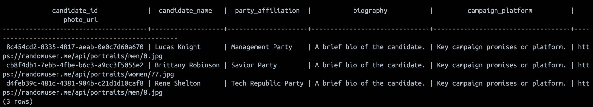
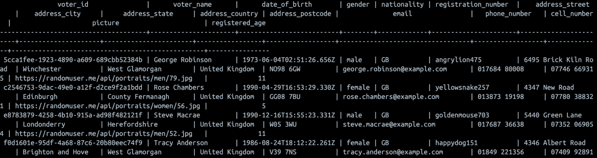
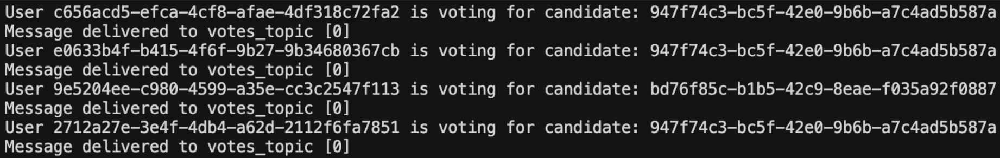
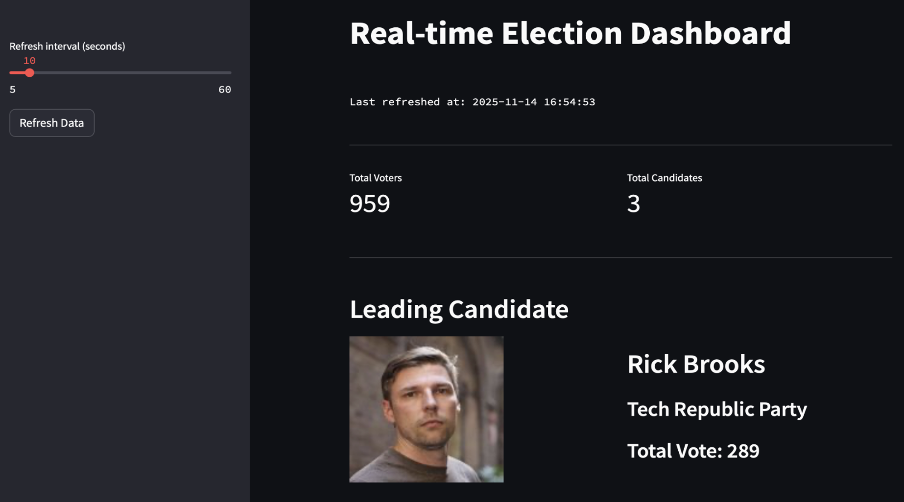

# Real-Time Election Voting System

A distributed, real-time election voting system that processes voting data through a streaming data pipeline. Built with Python, Apache Kafka, Apache Spark Streaming, PostgreSQL, and Streamlit, this system demonstrates event-driven architecture, real-time stream processing, and live data visualization.

## Table of Contents

- [System Architecture](#system-architecture)
- [System Flow](#system-flow)
- [System Components](#system-components)
- [Technology Stack](#technology-stack)
- [Prerequisites](#prerequisites)
- [Installation & Setup](#installation--setup)
- [Running the System](#running-the-system)
- [Database Schema](#database-schema)
- [Kafka Topics](#kafka-topics)
- [Screenshots](#screenshots)
- [Video Demo](#video-demo)

## System Architecture


The system follows an event-driven architecture with the following infrastructure components:
- **Zookeeper**: Coordinates Kafka brokers
- **Apache Kafka**: Message broker for streaming data between components
- **PostgreSQL**: Persistent storage for voters, candidates, and votes
- **Apache Spark Streaming**: Real-time stream processing and aggregation
- **Streamlit**: Web-based dashboard for real-time visualization

## System Flow


### Data Pipeline

1. **Data Generation** (`main.py`)
   - Generates candidate and voter data from external API
   - Stores data in PostgreSQL
   - Publishes voter data to Kafka

2. **Vote Processing** (`voting.py`)
   - Consumes voter data from Kafka
   - Simulates voting by randomly assigning candidates
   - Stores votes in PostgreSQL (with duplicate prevention)
   - Publishes enriched vote data to Kafka

3. **Stream Processing** (`spark-streaming.py`)
   - Consumes vote data from Kafka
   - Performs real-time aggregations (votes per candidate, turnout by location)
   - Publishes aggregated results back to Kafka

4. **Visualization** (`streamlit-app.py`)
   - Consumes aggregated data from Kafka
   - Fetches statistics from PostgreSQL
   - Displays real-time dashboard with charts and metrics

## System Components

### 1. main.py - Data Generation & Initialization

**Purpose**: Initializes the database schema and generates initial voter and candidate data.

**Key Features**:
- Creates PostgreSQL tables (`candidates`, `voters`, `votes`)
- Generates 3 candidates (one per political party)
- Generates 1000 voters using Random User API
- Publishes voter data to `voters_topic` Kafka topic

**Functions**:
- `generate_voter_data()`: Fetches random user data from API and formats as voter information
- `generate_candidate_data()`: Generates candidate data with party affiliations
- `create_tables()`: Creates required PostgreSQL tables
- `insert_voters()`: Inserts voter data into PostgreSQL database

**Output**: 
- PostgreSQL tables populated with candidates and voters
- Voter messages published to Kafka `voters_topic`

---

### 2. voting.py - Vote Processing Simulation

**Purpose**: Simulates the voting process by consuming voter data and generating votes.

**Key Features**:
- Consumes voter messages from `voters_topic`
- Randomly assigns candidates to voters
- Prevents duplicate votes using database constraints
- Enriches vote data with voter and candidate information
- Publishes complete vote records to `votes_topic`

**Operations**:
- Reads candidate data from PostgreSQL
- Consumes voters from Kafka `voters_topic` (one message at a time)
- For each voter, randomly selects a candidate
- Inserts vote into PostgreSQL with duplicate prevention
- Publishes enriched vote (voter + candidate + timestamp) to Kafka `votes_topic`

**Data Enrichment**:
- Combines voter data, candidate data, voting timestamp, and vote count into a single message

**Output**:
- Vote records stored in PostgreSQL `votes` table
- Enriched vote messages published to Kafka `votes_topic`

---

### 3. spark-streaming.py - Real-Time Stream Processing

**Purpose**: Processes voting data in real-time using Apache Spark Streaming to perform aggregations.

**Key Features**:
- Consumes vote data from Kafka `votes_topic`
- Applies watermarking (1 minute) for handling late-arriving data
- Performs real-time aggregations:
  - **Votes per candidate**: Groups by candidate and sums total votes
  - **Turnout by location**: Groups by state and counts votes
- Publishes aggregated results to Kafka topics
- Uses checkpointing for fault tolerance

**Spark Configuration**:
- Local execution mode with all available cores
- 2GB memory allocation for driver and executor
- Checkpoint-based recovery mechanism
- PostgreSQL JDBC driver for database connectivity (configured but not actively used)

**Aggregations**:
1. **Votes per Candidate** (`aggregated_votes_per_candidate` topic)
   - Groups by: `candidate_id`, `candidate_name`, `party_affiliation`, `photo_url`
   - Aggregation: Sum of votes

2. **Turnout by Location** (`aggregated_turnout_by_location` topic)
   - Groups by: `address.state`
   - Aggregation: Count of votes

**Output**:
- Aggregated vote totals published to `aggregated_votes_per_candidate` topic
- Location-based turnout data published to `aggregated_turnout_by_location` topic

**Note**: The code contains commented-out functionality for additional aggregations (by age, gender, party, region) that can be enabled if needed.

---

### 4. streamlit-app.py - Real-Time Dashboard

**Purpose**: Provides a web-based dashboard for visualizing election results in real-time.

**Key Features**:
- Real-time data updates from Kafka topics
- Configurable auto-refresh interval (5-60 seconds)
- Multiple visualization types (bar charts, donut charts, tables)
- Pagination for large datasets
- Leading candidate display with photo

**Dashboard Sections**:

1. **Metrics**
   - Total number of voters
   - Total number of candidates

2. **Leading Candidate**
   - Candidate photo, name, and party affiliation
   - Total vote count

3. **Statistics**
   - Bar chart showing votes per candidate
   - Donut chart showing vote distribution
   - Table with candidate statistics

4. **Location Analysis**
   - Paginated table showing voter turnout by state
   - Sortable and filterable data

**Data Sources**:
- PostgreSQL: Voter and candidate counts
- Kafka `aggregated_votes_per_candidate`: Real-time candidate vote totals
- Kafka `aggregated_turnout_by_location`: Real-time location-based turnout

**Functions**:
- `create_kafka_consumer()`: Creates Kafka consumer for specified topic
- `fetch_voting_stats()`: Retrieves statistics from PostgreSQL (cached)
- `fetch_data_from_kafka()`: Polls Kafka for new messages
- `plot_colored_bar_chart()`: Creates bar chart visualization
- `plot_donut_chart()`: Creates donut chart visualization
- `paginate_table()`: Implements pagination for large tables
- `update_data()`: Main function that refreshes all dashboard data

---

## Technology Stack

### Core Technologies
- **Python 3.9+**: Main programming language
- **Apache Kafka 7.4.0**: Distributed event streaming platform
- **Apache Spark 3.5.0**: Distributed stream processing engine
- **PostgreSQL**: Relational database management system
- **Streamlit**: Rapid web application framework for data visualization

### Python Libraries
- `confluent-kafka`: Kafka producer and consumer client
- `kafka-python`: Alternative Kafka client (used in Streamlit)
- `pyspark`: Python API for Apache Spark
- `psycopg2-binary`: PostgreSQL database adapter
- `streamlit`: Web dashboard framework
- `streamlit-autorefresh`: Auto-refresh functionality for Streamlit
- `pandas`: Data manipulation and analysis
- `matplotlib`: Data visualization and plotting
- `requests`: HTTP library for API calls
- `simplejson`: JSON serialization

### Infrastructure
- **Docker Compose**: Container orchestration
- **Zookeeper 7.4.0**: Coordination service for Kafka
- **PostgreSQL**: Latest version

---

## Prerequisites

Before running the system, ensure you have the following installed:

- **Python 3.9 or higher**
- **Docker** (latest version)
- **Docker Compose** (latest version)

---

## Installation & Setup

### Step 1: Clone the Repository

```bash
git clone <repository-url>
cd realtime-voting-data-engineering
```

### Step 2: Start Infrastructure Services

Start Zookeeper, Kafka, and PostgreSQL using Docker Compose:

```bash
docker-compose up -d
```

This command will:
- Start Zookeeper on port `2181`
- Start Kafka broker on port `9092` (JMX on `9101`)
- Start PostgreSQL on port `5432`

**Verify Services**:
```bash
docker-compose ps
```

All services should show as "healthy" or "running".

### Step 3: Install Python Dependencies

Create a virtual environment (recommended):

```bash
python -m venv venv
source venv/bin/activate  # On Windows: venv\Scripts\activate
```

Install required packages:

```bash
pip install -r requirements.txt
```

---

## Running the System

The system requires multiple components running simultaneously. Open multiple terminal windows or use a terminal multiplexer (e.g., `tmux` or `screen`).

### Terminal 1: Initialize Data

Generate candidates and voters, and populate Kafka topics:

```bash
python main.py
```

**Expected Output**:
- Database tables created
- 3 candidates generated and stored
- 1000 voters generated and stored in PostgreSQL
- Voter messages published to Kafka `voters_topic`

Wait for this script to complete before proceeding.

### Terminal 2: Process Votes

Start the vote processing simulation:

```bash
python voting.py
```

**Expected Output**:
- Consuming voters from `voters_topic`
- Generating votes and assigning candidates
- Publishing votes to `votes_topic`

This script runs continuously. Keep it running.

### Terminal 3: Stream Processing

Start Spark Streaming for real-time aggregation:

```bash
python spark-streaming.py
```

**Expected Output**:
- SparkSession initialized
- Consuming from `votes_topic`
- Aggregating votes in real-time
- Publishing results to aggregated topics

This script runs continuously. Keep it running.

### Terminal 4: Dashboard

Start the Streamlit dashboard:

```bash
streamlit run streamlit-app.py
```

**Expected Output**:
- Dashboard accessible at `http://localhost:8501`
- Auto-refreshing with real-time data

The dashboard will open in your default web browser automatically.

---

## Database Schema

### candidates Table
| Column | Type | Description |
|--------|------|-------------|
| `candidate_id` | VARCHAR(255) | Primary key, unique candidate identifier |
| `candidate_name` | VARCHAR(255) | Full name of the candidate |
| `party_affiliation` | VARCHAR(255) | Political party name |
| `biography` | TEXT | Candidate biography |
| `campaign_platform` | TEXT | Campaign platform description |
| `photo_url` | TEXT | URL to candidate photo |

### voters Table
| Column | Type | Description |
|--------|------|-------------|
| `voter_id` | VARCHAR(255) | Primary key, unique voter identifier |
| `voter_name` | VARCHAR(255) | Full name of the voter |
| `date_of_birth` | VARCHAR(255) | Date of birth |
| `gender` | VARCHAR(255) | Gender |
| `nationality` | VARCHAR(255) | Nationality code |
| `registration_number` | VARCHAR(255) | Voter registration number |
| `address_street` | VARCHAR(255) | Street address |
| `address_city` | VARCHAR(255) | City |
| `address_state` | VARCHAR(255) | State/Province |
| `address_country` | VARCHAR(255) | Country |
| `address_postcode` | VARCHAR(255) | Postal code |
| `email` | VARCHAR(255) | Email address |
| `phone_number` | VARCHAR(255) | Phone number |
| `cell_number` | VARCHAR(255) | Cell phone number |
| `picture` | TEXT | URL to voter photo |
| `registered_age` | INTEGER | Age at registration |

### votes Table
| Column | Type | Description |
|--------|------|-------------|
| `voter_id` | VARCHAR(255) | Foreign key to voters table |
| `candidate_id` | VARCHAR(255) | Foreign key to candidates table |
| `voting_time` | TIMESTAMP | Timestamp when vote was cast |
| `vote` | INTEGER | Vote count (default: 1) |
| **Primary Key** | (voter_id, candidate_id) | Composite primary key |

**Note**: The composite primary key ensures each voter can only vote once per candidate, preventing duplicate votes.

---

## Kafka Topics

The system uses the following Kafka topics for message passing:

| Topic Name | Purpose | Producer | Consumer |
|------------|---------|----------|----------|
| `voters_topic` | Voter registration data | `main.py` | `voting.py` |
| `votes_topic` | Complete vote records (voter + candidate + timestamp) | `voting.py` | `spark-streaming.py` |
| `aggregated_votes_per_candidate` | Real-time vote totals per candidate | `spark-streaming.py` | `streamlit-app.py` |
| `aggregated_turnout_by_location` | Real-time voter turnout by state | `spark-streaming.py` | `streamlit-app.py` |

### Topic Flow

```
main.py → voters_topic → voting.py → votes_topic → spark-streaming.py
                                                           ↓
                                    aggregated_votes_per_candidate → streamlit-app.py
                                    aggregated_turnout_by_location → streamlit-app.py
```

---

## Screenshots

### Candidates and Parties Information


### Voters


### Voting


### Dashboard


---

## Video Demo

[](https://youtu.be/X-JnC9daQxE)

---

## Additional Configuration

### Modifying Docker Compose Settings

To modify Kafka or Zookeeper configurations, edit the `docker-compose.yml` file:

- **Port Changes**: Update port mappings in the `ports` section
- **Kafka Settings**: Modify `KAFKA_*` environment variables
- **PostgreSQL Settings**: Update `POSTGRES_*` environment variables

### Spark Configuration

Spark settings can be modified in `spark-streaming.py`:

- **Memory Allocation**: Modify `spark.driver.memory` and `spark.executor.memory`
- **Checkpoint Location**: Update `checkpointLocation` paths
- **Watermarking**: Adjust watermark interval in `withWatermark()`

### Streamlit Configuration

Dashboard settings can be configured in `streamlit-app.py`:

- **Refresh Interval**: Adjust slider range in `sidebar()` function
- **Visualization Styles**: Modify chart functions (`plot_colored_bar_chart`, `plot_donut_chart`)
- **Pagination**: Adjust `batch_size` options in `paginate_table()`

---

## Troubleshooting

### Kafka Connection Issues
- Ensure Docker containers are running: `docker-compose ps`
- Check Kafka broker logs: `docker-compose logs broker`
- Verify Kafka is accessible: `docker-compose exec broker kafka-topics --list --bootstrap-server localhost:9092`

### PostgreSQL Connection Issues
- Verify PostgreSQL is running: `docker-compose ps postgres`
- Check database connection: `docker-compose exec postgres psql -U postgres -d voting`
- Ensure database credentials match in Python scripts

### Spark Streaming Issues
- Check checkpoint directories exist and have write permissions
- Verify Kafka topic `votes_topic` has messages
- Review Spark logs for detailed error messages

### Streamlit Dashboard Issues
- Ensure Kafka topics have data (run other components first)
- Check Kafka consumer connection in dashboard logs
- Verify auto-refresh interval is set appropriately

---

## Project Structure

```
realtime-voting-data-engineering/
├── main.py                 # Data generation and initialization
├── voting.py               # Vote processing simulation
├── spark-streaming.py      # Real-time stream processing
├── streamlit-app.py        # Dashboard application
├── docker-compose.yml      # Infrastructure configuration
├── requirements.txt        # Python dependencies
├── postgresql-42.7.1.jar   # PostgreSQL JDBC driver
├── README.md               # Project documentation
├── PROJECT_SUMMARY.md      # Detailed project summary
├── EXECUTION_RESULTS.md    # Execution results and notes
├── checkpoints/            # Spark streaming checkpoints
│   ├── checkpoint1/        # Votes per candidate checkpoint
│   └── checkpoint2/        # Turnout by location checkpoint
└── images/                 # Documentation images
    ├── system_architecture.jpg
    ├── system_flow.jpg
    ├── candidates_and_party.png
    ├── voters.png
    ├── voting.png
    └── dashboard_image.png
```

---

## License

[Add your license information here]

---

## Contributing

[Add contribution guidelines here]

---

## Author

[Add author information here]
